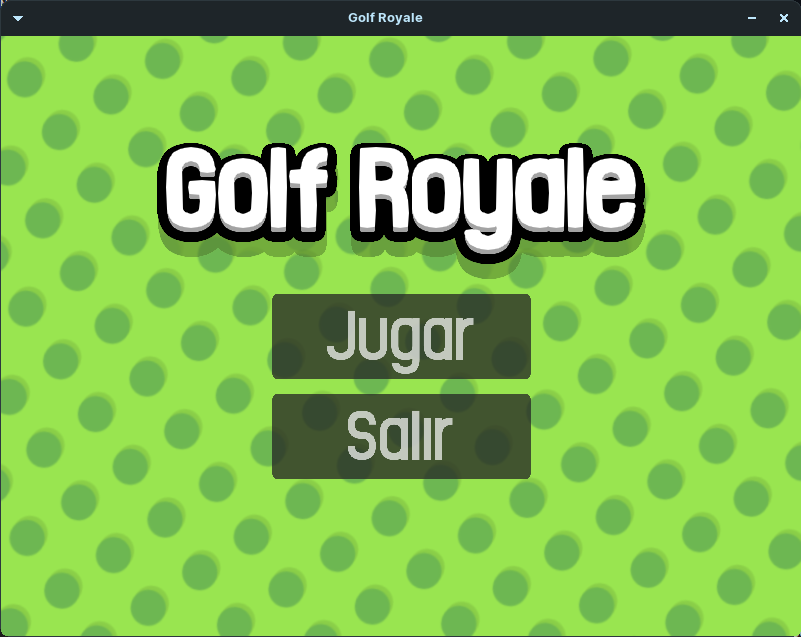

# Golf Royale

Golf Royale is an open source online multiplayer game developed as final project for college subject. It currently uses POSIX Sockets for handling the network part. It will be migrated to SDL_Net soon to also support Windows.

  


Roadmap of features will be around the end of this file.

# How to build

## First step (for all platforms)

Easy, first clone this git repo:
```sh
git clone https://github.com/Nrosa01/Proyecto-Final-Redes
```


## Linux, MacOS and Windows

There are build instructions inside [client](./Client/BUILD.md) and [server](./Server/BUILD.md) folders, including requisites.


# How to launch the game or the server

This step assumes you've already been the project as binary aren't distributed in the repo.

## Linux and MacOS

Inside Client or Server, just call
```sh
./bin/AppName args
```
Where app name is Golf-Royale-Debug/Release or Golf-Server-Debug/Release depending on what folder you are in.

----


There are also some bash scripts for making this easier:

### BuildAndExecute
```sh
bash buildAndExecute.bash (-r) ip_address port
```

You can build for debug with the flag -d or with no flag, and for release with -r flag.

----

### ExecuteOnlyBash
```sh
bash executeOnlyBash.bash (-r) ip_address port
```

Yey you guessed it, this just runs the app, but doesn't builds it.

-----

There is also an special bat inside Client:

### MultiExecuteBash

```sh
bash multiExecuteBash.bash number (-r) ip address
```

This creates n instances of the game, mainly suited for testing purposes, it works the same as executeOnlyBash. If the first argument is not a number it will call executeOnlyBashInstead.

The program currently don't sanitize the input, if you pass a string instead of an IP it will probably crash.

## Windows

Soon...

# Using the game and the server

In it's current state, the game can connect to a server IP and PORT, you can launch the server with arguments 0.0.0.0 13000 and two Client with those same arguments and it will work if they are in the same machine. If you want to join to a server that's in another machine you'll need a proxy or a VPN to that machine.

In the future I expect to upload the server to Heraku so anyone can play without having to host a server.

# Roadmap

Here I'll lazily list features and thing I want to get done as far of now. They are ordered by priority. Finish time won't be written because just depends on whether I feel like programming or not.

- [x] Update Makefile to build debug and release.
- [x] Sanity check program arguments, quit game if SDL fails to init.
- [ ] Add an input thread to the server to be able to quit it safely.
- [ ] Improve ball physics (implement continuos collision detection).
- [ ] Change netcode from sockets to SDL_Net (TCP instead of UDP).
- [x] Improve text render efficiency.
- [ ] Refactor ball code, separate offline from remote.
- [ ] Add visual feedback of where you start to press the ball.
- [ ] Add Windows and CentOS support (build .exe, .deb and .rpm).
- [ ] Serialize levels in 128 bytes as maximum.
- [ ] Make the ball use a circle collider.
- [ ] Implemente fixedUpdate step and proper physics.
- [ ] Ground types (ice, normal...).
- [ ] Level editor.
- [ ] Refactor code, separate engine from game.
- [ ] Change windows ratio to 16/9, add real adaptative UI and fullscreen support.
- [ ] Automatically turn off server after not receiving petitions for x time.
- [ ] Add support for rooms for more than 2 players (8 max)

# FAQ

Got any question? Sweet, then create and issue.

# License

All of the code is under MIT License

Assets are under